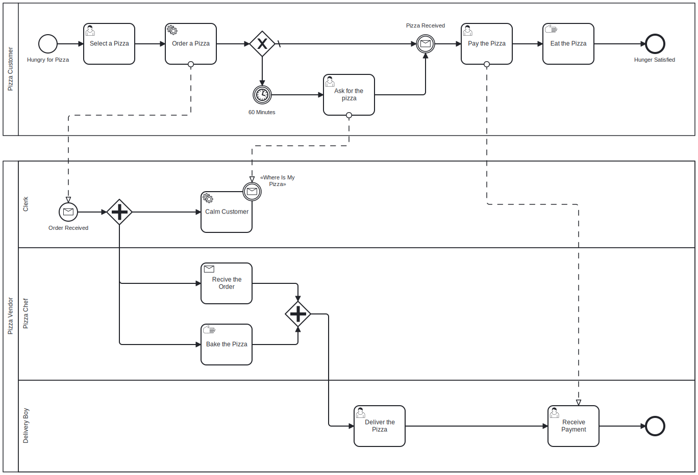

# Examples

__Projects__: 

- [workflow-template](https://github.com/vhidvz/workflow-template) is an example of creating a simple workflow microservice.

## Prerequisites

Before running the following command please make sure you have installed Node version 18 or higher with NPM and GIT tool.

```sh
git clone https://github.com/vhidvz/workflow-js.git
cd workflow-js && npm ci
```

## Schema



## Build and Execute

```sh
npm run start:example01
```

```sh
npm run start:example02
```

```sh
npm run start:example03
```

```sh
npm run start:example04
```

```sh
npm run start:example05
```

```sh
npm run start:example06
```
